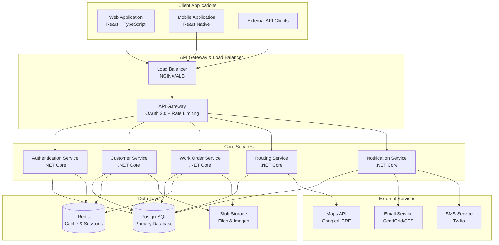

# Architecture Overview

Field-Compass-IQ is built using modern microservices architecture principles with a focus on scalability, security, and maintainability.

## High-Level Architecture

## Core Principles

### 1. Microservices Architecture
- **Domain-Driven Design**: Each service owns its domain
- **Loose Coupling**: Services communicate via well-defined APIs
- **Independent Deployment**: Services can be deployed independently
- **Technology Diversity**: Each service can use appropriate technology stack

### 2. Multi-Tenant Architecture
- **Database-per-Tenant**: Complete data isolation
- **Tenant Context**: All requests include tenant information
- **Resource Isolation**: Independent scaling per tenant
- **Security Boundaries**: Tenant-specific access controls

### 3. Event-Driven Architecture
- **Domain Events**: Services publish events for state changes
- **Event Sourcing**: Complete audit trail of all changes
- **Asynchronous Processing**: Non-blocking operations
- **Webhook Integration**: Real-time notifications to external systems

### 4. CQRS Pattern
- **Command Queries Separation**: Separate read and write models
- **Optimized Queries**: Read models optimized for specific use cases
- **Eventual Consistency**: Asynchronous data synchronization
- **Scalability**: Independent scaling of read and write operations

## Technology Stack

### Backend Services
- **.NET 9**: Modern C# with latest features
- **ASP.NET Core**: High-performance web framework
- **Entity Framework Core**: ORM for data access
- **MediatR**: CQRS and mediator pattern implementation
- **FluentValidation**: Input validation
- **SignalR**: Real-time communication

### Frontend Applications
- **React 18**: Modern React with hooks
- **TypeScript**: Type-safe development
- **React Native**: Cross-platform mobile development
- **React Query**: Data fetching and caching
- **Tailwind CSS**: Utility-first styling

### Data Storage
- **PostgreSQL**: Primary relational database
- **Redis**: Caching and session storage
- **Blob Storage**: File and image storage (AWS S3/Azure Blob)

### Infrastructure
- **Kubernetes**: Container orchestration
- **Docker**: Containerization
- **Terraform**: Infrastructure as Code
- **GitHub Actions**: CI/CD pipelines

## Security Architecture

### Authentication & Authorization
- **OAuth 2.0 / OpenID Connect**: Industry standard authentication
- **JWT Tokens**: Stateless authentication
- **Role-Based Access Control**: Fine-grained permissions
- **Multi-Factor Authentication**: Enhanced security

### Data Protection
- **Encryption at Rest**: Database and file encryption
- **Encryption in Transit**: TLS 1.3 for all communications
- **Data Masking**: Sensitive data protection
- **Audit Logging**: Complete audit trail

### Network Security
- **API Gateway**: Centralized security enforcement
- **Rate Limiting**: DDoS protection
- **IP Whitelisting**: Restricted access
- **Web Application Firewall**: Protection against common attacks

## Scalability & Performance

### Horizontal Scaling
- **Stateless Services**: Easy to scale horizontally
- **Load Balancing**: Traffic distribution across instances
- **Auto-Scaling**: Automatic scaling based on metrics
- **Multi-Region**: Global deployment capability

### Performance Optimization
- **Caching Strategy**: Multi-layer caching
- **Database Optimization**: Indexing and query optimization
- **CDN**: Global content delivery
- **Compression**: Response compression

### Monitoring & Observability
- **Application Performance Monitoring**: Real-time metrics
- **Distributed Tracing**: Request tracing across services
- **Centralized Logging**: Aggregated log analysis
- **Health Checks**: Service health monitoring

## Deployment Architecture

### Environments
- **Development**: Local development environment
- **Staging**: Pre-production testing
- **Production**: Live environment
- **Disaster Recovery**: Backup environment

### CI/CD Pipeline
- **Continuous Integration**: Automated testing and building
- **Continuous Deployment**: Automated deployment to environments
- **Blue-Green Deployment**: Zero-downtime deployments
- **Rollback Strategy**: Quick rollback capability

## Next Steps

1. [Microservices Design](microservices.md)
2. [Database Architecture](database.md)
3. [Security Architecture](security.md)
4. [Deployment Architecture](deployment.md)