# Welcome to Field-Compass-IQ Documentation

Field-Compass-IQ is an intelligent CRM and routing application designed for mobile workforces. This documentation provides comprehensive guides for developers, users, and system administrators.

## Quick Navigation

-   :material-rocket-launch-outline: **Getting Started**

    ---

    Set up your development environment and start building with Field-Compass-IQ.

    [:octicons-arrow-right-24: Development Guide](development/getting-started.md)

-   :material-api: **API Reference**

    ---

    Complete API documentation with examples and integration guides.

    [:octicons-arrow-right-24: API Docs](api/README.md)

-   :material-account-group: **User Guides**

    ---

    Learn how to use the web and mobile applications effectively.

    [:octicons-arrow-right-24: User Guides](user-guides/web-app.md)

-   :material-cog: **Operations**

    ---

    Deploy, monitor, and maintain Field-Compass-IQ in production.

    [:octicons-arrow-right-24: Operations](operations/monitoring.md)

## What is Field-Compass-IQ?

Field-Compass-IQ is a comprehensive platform that revolutionizes mobile workforce management through:

### :material-account-multiple: **Customer Relationship Management**
- Complete customer profiles and contact management
- Interaction history tracking and communication hub
- Lead management and sales pipeline optimization
- Multi-channel customer engagement

### :material-map-marker-path: **Intelligent Route Planning**
- AI-powered route optimization for multiple stops
- Real-time traffic integration and dynamic adjustments
- Territory management and workload distribution
- GPS tracking with live ETA updates

### :material-clipboard-list: **Work Order Management**
- Mobile-optimized work order interface
- Skills-based scheduling and assignment
- Quality control with photo evidence and digital signatures
- Complete audit trail for compliance

### :material-chart-line: **Analytics & Reporting**
- Real-time operational metrics dashboard
- Route performance analytics and optimization insights
- Customer behavior analysis and satisfaction tracking
- Custom report generation and data export

## Architecture Overview

Field-Compass-IQ is built on modern microservices architecture:

```mermaid
graph TB
    subgraph "Frontend Applications"
        WEB["🌐 Web App<br/>(React + TypeScript)"]
        MOBILE["📱 Mobile App<br/>(React Native)"]
    end
    
    subgraph "Backend Services"
        API["⚡ API Gateway<br/>(.NET Core)"]
        AUTH["🔐 Auth Service"]
        CRM["👥 Customer Service"]
        WO["📋 Work Order Service"]
        ROUTE["🗺️ Routing Service"]
    end
    
    subgraph "Data Layer"
        DB["🗄️ PostgreSQL"]
        CACHE["⚡ Redis"]
        FILES["📁 Blob Storage"]
    end
    
    WEB --> API
    MOBILE --> API
    API --> AUTH
    API --> CRM
    API --> WO
    API --> ROUTE
    
    AUTH --> DB
    CRM --> DB
    WO --> DB
    ROUTE --> DB
    
    CRM --> CACHE
    WO --> FILES
```

## Key Features

### :material-security: **Enterprise Security**
- Multi-tenant architecture with complete data isolation
- OAuth 2.0 / OpenID Connect authentication
- Role-based access control with fine-grained permissions
- End-to-end encryption and comprehensive audit logging

### :material-cellphone-link: **Mobile-First Design**
- Offline-capable mobile application
- GPS integration and turn-by-turn navigation
- Camera functionality with automatic photo tagging
- Real-time synchronization when connectivity restored

### :material-api: **Integration Ready**
- RESTful APIs with comprehensive documentation
- Webhook support for real-time notifications
- External CRM integration (Salesforce, HubSpot, etc.)
- Third-party mapping services integration

### :material-cloud: **Cloud Native**
- Kubernetes-ready containerized deployment
- Auto-scaling based on demand
- Multi-region deployment capability
- Infrastructure as Code with Terraform

## Technology Stack

### Backend
- **.NET 9** - Modern C# web API framework
- **Entity Framework Core** - ORM for data access
- **PostgreSQL** - Primary database
- **Redis** - Caching and session management
- **SignalR** - Real-time communication

### Frontend
- **React 18** - Modern web application framework
- **TypeScript** - Type-safe development
- **React Native** - Cross-platform mobile development
- **Tailwind CSS** - Utility-first styling
- **React Query** - Data fetching and state management

### Infrastructure
- **Docker** - Containerization
- **Kubernetes** - Container orchestration
- **Terraform** - Infrastructure as Code
- **GitHub Actions** - CI/CD pipelines

## Support & Community

- **Documentation**: You're here! 📚
- **GitHub Issues**: [Report bugs and request features](https://github.com/Tvck3r/field-compass-iq/issues)
- **Discussions**: [Community discussions](https://github.com/Tvck3r/field-compass-iq/discussions)
- **API Status**: Monitor system status and uptime

---

**Ready to get started?** Check out our [Getting Started Guide](development/getting-started.md) or explore the [API Documentation](api/README.md).